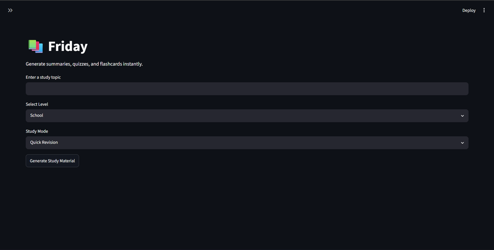
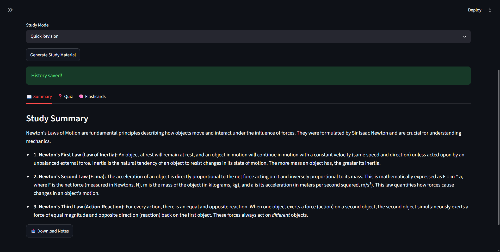
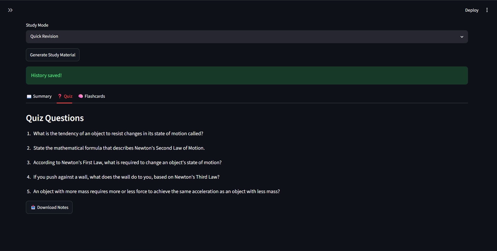
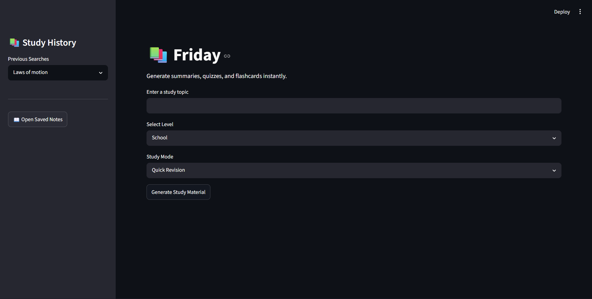
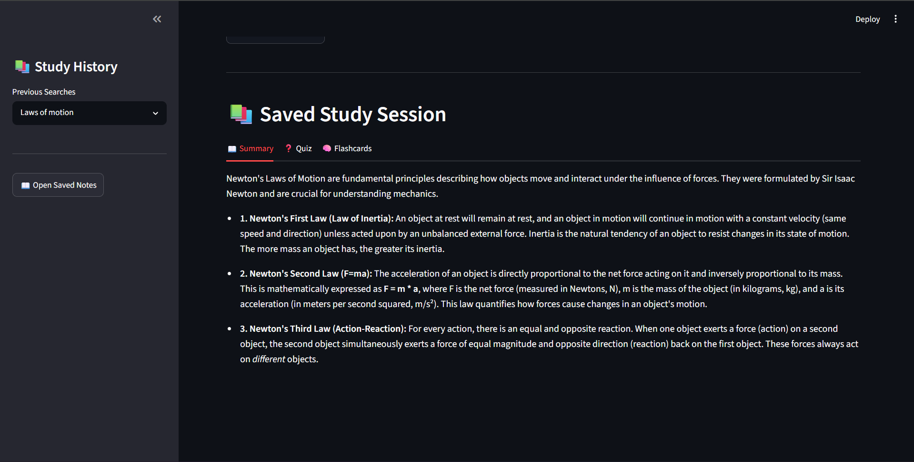

# AI Study Assistant

An AI-powered study assistant built using Python, Streamlit, and Google's Gemini API.

## Features

- Generate study summaries
- Create quiz questions
- Generate flashcards
- Multiple study modes
  - Quick Revision
  - Detailed Notes
  - Exam Preparation
  - Flashcards Only
- Study history tracking
- Download generated notes

## Tech Stack

- Python
- Streamlit
- Gemini API
- JSON
- Git & GitHub

## Installation

git clone https://github.com/yourusername/AI-Study-Assistant.git

cd AI-Study-Assistant

pip install -r requirements.txt

streamlit run app.py

## Screenshots

